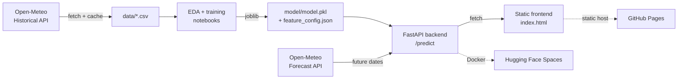

# ☔ Santo Domingo Rain Predictor

An end-to-end machine-learning project that predicts the **probability of rain in Santo Domingo, Dominican Republic** from daily atmospheric conditions — trained on 10 years of historical weather, served through a FastAPI backend, and consumed by a static frontend.

It's built to mirror a real production ML deployment rather than a one-off notebook: data pipeline → trained model → versioned artifacts → API with live-forecast fallback → deployed UI.

> **Live demo:** _frontend on GitHub Pages_ · _API on Hugging Face Spaces_ — links added after deployment.

---

## What it does

Pick a date and get the modeled probability that it rains in Santo Domingo that day (rain = daily precipitation ≥ 1.0 mm, the WMO wet-day standard).

- **Past dates** are scored directly from recorded weather.
- **Future dates** (up to 16 days out) trigger a server-side call to Open-Meteo's live forecast API, whose values are then scored by the model.

---

## Architecture



The API builds feature vectors from a shared `feature_config.json` written at training time, so the serving code never hardcodes a feature list that could drift from what the model was trained on.

---

## Model

A `scikit-learn` **logistic regression** (standardized features) chosen for interpretability and because it's a strong, honest baseline for a binary weather-classification task.

**Features:** daily max/min/mean temperature, mean relative humidity, mean surface pressure, max wind speed, plus a cyclical `sin`/`cos` encoding of the month. `precipitation_sum` is deliberately excluded — it defines the target and would leak the label.

**Evaluation:** trained on 2015–2022, tested on a **chronologically held-out** 2023–2024 (no random split, since consecutive days are autocorrelated and a random split would leak information between adjacent train/test days).

| Metric | Held-out (2023–2024) |
|---|---|
| Accuracy | 0.778 |
| Precision | 0.793 |
| Recall | 0.838 |
| F1 | 0.815 |
| ROC-AUC | 0.862 |

For comparison, a naive "always predict the majority class" baseline scores 0.583 accuracy. The shipped model is then refit on the full 2015–2024 history.

---

## Tech stack

- **Data / ML:** Python, pandas, NumPy, scikit-learn, joblib
- **EDA:** Jupyter, matplotlib, seaborn
- **Backend:** FastAPI, Pydantic, Uvicorn, requests
- **Frontend:** plain HTML / CSS / JS (no framework)
- **Deployment:** Docker → Hugging Face Spaces (API); GitHub Pages (frontend)
- **Data source:** [Open-Meteo](https://open-meteo.com/) (free, no API key)

---

## Repository structure

```
rain-predictor/
├── data/                         cached historical CSV
├── notebooks/
│   ├── 01_eda.ipynb              exploratory analysis + threshold choice
│   └── 02_modeling.ipynb         features, training, evaluation, model export
├── model/
│   ├── model.pkl                 fitted sklearn Pipeline (scaler + logreg)
│   └── feature_config.json       feature order, threshold, metrics
├── scripts/
│   └── fetch_historical_data.py  pull + cache Open-Meteo history
├── api/
│   ├── main.py                   FastAPI app (/predict, /health)
│   ├── schemas.py                Pydantic request/response models
│   ├── weather.py                Open-Meteo client (archive + forecast)
│   ├── model_service.py          model loading, scoring, cached lookups
│   ├── requirements.txt          serving deps (ML stack version-pinned)
│   └── Dockerfile                container for Hugging Face Spaces
├── frontend/
│   └── index.html                static UI, calls the API via fetch()
└── requirements.txt              full dev environment
```

---

## Running locally

Requires Python 3.12+ (the pinned `numpy`/`scipy` builds need ≥3.12; developed and deployed on 3.13).

### 1. Set up the environment

```bash
python -m venv .venv
# Windows:  .venv\Scripts\activate
# macOS/Linux:  source .venv/bin/activate
pip install -r requirements.txt
```

### 2. Fetch the historical data

```bash
python scripts/fetch_historical_data.py
```

Writes `data/santo_domingo_historical.csv` (10 years of daily weather). A cached copy is already committed, so this is only needed to refresh it.

### 3. (Optional) Reproduce EDA + training

Run `notebooks/01_eda.ipynb` then `notebooks/02_modeling.ipynb`. The second notebook regenerates `model/model.pkl` and `model/feature_config.json`.

### 4. Run the API

```bash
cd api
uvicorn main:app --reload --port 8000
```

Interactive docs at `http://127.0.0.1:8000/docs`.

### 5. Open the frontend

Serve the `frontend/` folder statically (so the browser treats it as `localhost`, which auto-points the UI at the local API):

```bash
cd frontend
python -m http.server 5500
```

Then visit `http://localhost:5500`.

---

## API

### `POST /predict`

**Request**
```json
{ "date": "2026-07-10" }
```

**Response**
```json
{
  "date": "2026-07-10",
  "rain_probability": 0.6438,
  "will_rain": true,
  "source": "forecast",
  "rain_threshold_mm": 1.0
}
```

`source` is `historical` when scored from recorded weather and `forecast` when scored from a live Open-Meteo forecast. Requests for dates more than 16 days ahead return `400`; upstream weather failures return `502` with a descriptive message.

### `GET /health`

Returns `{"status": "ok"}`.

---

## Deployment

- **Backend → Hugging Face Spaces (Docker SDK).** The image (`api/Dockerfile`) bundles the API, the model artifacts, and the cached CSV, and listens on port `7860`. Note: HF Spaces expects the `Dockerfile` at the Space repo root, so the build context/path is set accordingly at deploy time.
- **Frontend → GitHub Pages.** `frontend/index.html` auto-selects its API base: `localhost` during development, the deployed Space URL in production (set `HF_SPACE_URL` in the script before deploying).

---

## Notes & limitations

- The model uses **same-day** atmospheric conditions, so future-date accuracy is bounded by the accuracy of the upstream forecast.
- The three temperature features are collinear; their individual coefficients shouldn't be read as importance (this doesn't affect predictive performance). See `notebooks/02_modeling.ipynb` for detail.
- Trained specifically for Santo Domingo's coordinates and tropical climate — not intended to generalize to other locations without retraining.

---

## Credits

Weather data by [Open-Meteo](https://open-meteo.com/). Built by **[@matossoluciones](https://www.linkedin.com/)** as a portfolio project demonstrating a full ML lifecycle from data to deployment.
